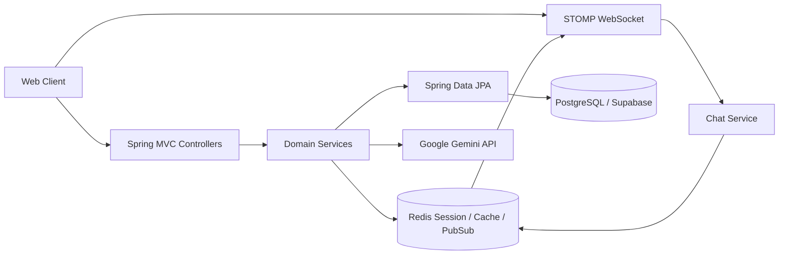
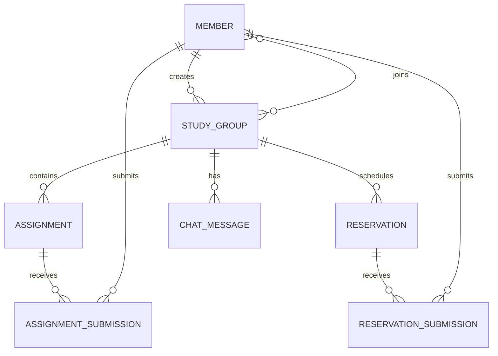

# StudySpace 프로젝트 구현 보고서

## 1. 프로젝트 개요

StudySpace는 스터디 그룹을 중심으로 학습 자료, 과제, 문제 풀이, 채팅을 한곳에서 제공하고, Gemini 기반 AI로 학습 문제를 생성하는 스터디 협업 플랫폼이다. 현재 저장소의 Spring Boot 애플리케이션은 `StudyWithMe`라는 프로젝트명으로 구성되어 있으며, 본 보고서는 현재 코드에 실제로 구현된 백엔드 범위를 기준으로 작성했다.

### 1.1 추진 배경

일반적인 스터디는 메신저, 문서 도구, 문제집, 과제 관리 도구가 분리되어 협업 내용과 학습 결과가 흩어진다. StudySpace는 스터디 생성부터 과제 제출과 채점까지를 통합하여 스터디원이 같은 공간에서 소통하고 학습하도록 하는 것을 목표로 한다.

### 1.2 기대 효과

- 초대 코드 기반으로 스터디를 빠르게 생성하고 참여할 수 있다.
- 리더가 일반 과제 또는 AI가 생성한 과제를 등록할 수 있다.
- 스터디원은 기한 내 과제를 제출하고, 리더는 제출물을 조회·채점할 수 있다.
- STOMP와 Redis를 이용해 여러 서버 환경을 고려한 실시간 채팅 기반을 제공한다.
- 향후 노트와 자료를 문제 생성의 입력으로 연결할 수 있는 확장 기반을 확보한다.

## 2. 프로젝트 목표와 범위

### 2.1 목표

회원과 스터디를 관리하고, 스터디별 과제 생성·제출·채점 및 실시간 커뮤니케이션을 제공한다. Gemini API를 통해 제목, 문제 내용, 모범 답안을 생성하여 리더가 검토 후 과제로 확정할 수 있도록 한다.

### 2.2 현재 구현 범위

| 기능 영역 | 구현 상태 | 주요 내용 |
|---|---|---|
| 회원 | 구현 | 이름 중복 확인, 로그인·가입, BCrypt 비밀번호 처리 |
| 스터디 | 구현 | 생성, 초대 코드 참여, 내 스터디 목록 |
| 과제 | 구현 | 일반 과제 생성, 기한 검증, 제출, 리더 조회, 채점 |
| AI 출제 | 부분 구현 | Gemini 기반 과제 초안 생성 후 리더가 확정 |
| 예약형 과제 | 부분 구현 | 공개 시간·마감 시간 검증, Redis 캐시, 제출 |
| 채팅 | 구현 | STOMP/SockJS, Redis Pub/Sub, 채팅 이력 조회 |
| 공동 필기 | 미구현 | 노트 엔티티·API·실시간 편집 경로 없음 |
| 자료 공유 | 미구현 | 파일 저장·조회·권한 관리 경로 없음 |
| 알림 | 미구현 | 알림 도메인 및 전달 API 없음 |
| 점수·오답 통계 | 미구현 | 점수 집계·평균·오답 분석 API 없음 |

초기 목표인 객관식·단답형 자동 채점은 현재 코드에서 완성된 형태로 확인되지 않는다. 현재 일반 과제의 채점은 리더가 제출물을 보고 점수와 피드백을 직접 등록하는 구조다.

## 3. 시스템 구성

### 3.1 기술 스택

| 구분 | 기술 |
|---|---|
| 언어·실행 환경 | Java 17 |
| 애플리케이션 | Spring Boot 4.0.5, Spring MVC |
| 데이터베이스 | PostgreSQL, Supabase 연동 |
| ORM | Spring Data JPA, Hibernate |
| 인증·인가 | Spring Security, BCrypt, HTTP Session |
| 분산 세션 | Spring Session Data Redis |
| 실시간 통신 | WebSocket, STOMP, SockJS |
| 메시지 브로커 | Redis Pub/Sub 및 STOMP broker |
| AI | Google Gemini REST API, `RestTemplate` |
| 빌드 | Gradle Wrapper |

### 3.2 논리 아키텍처



컨트롤러는 요청과 응답을 담당하고, 서비스가 회원·스터디·과제·예약·채팅의 검증과 업무 규칙을 수행한다. PostgreSQL은 영속 데이터, Redis는 세션과 예약 과제 캐시 및 채팅 메시지 전달을 담당한다.

## 4. 도메인 및 데이터 모델



- `Member`: 회원 식별자, 이름, BCrypt 비밀번호, 생성일을 보관한다.
- `StudyGroup`: 스터디 제목·설명·8자리 초대 코드를 보관하며 생성자와 참여 회원을 관리한다.
- `Assignment`: 스터디 소속 과제, 내용, 모범 답안, 생성일, 마감일을 보관한다.
- `AssignmentSubmission`: 회원별 답변, 제출 시각, 점수, 피드백, 채점 시각을 보관한다.
- `Reservation`: 정해진 공개 시각과 종료 시각을 가진 예약형 학습 과제다.
- `ChatMessage`: 스터디 ID, 발신자 이름, 메시지, 작성 시각을 보관한다. 현재 스터디와 JPA 연관관계 대신 scalar `studyId`를 사용한다.

## 5. 주요 API

### 5.1 인증·스터디

| HTTP | 경로 | 설명 |
|---|---|---|
| GET | `/api/auth/check-name` | 회원 이름 사용 여부 확인 |
| POST | `/api/auth/continue` | 기존 회원 로그인 또는 신규 회원 가입 |
| POST | `/api/studies/create` | 스터디 생성 및 생성자 자동 참여 |
| POST | `/api/studies/join` | 초대 코드로 스터디 참여 |
| GET | `/api/studies/mystudylist` | 로그인 회원의 스터디 목록 조회 |

### 5.2 과제·제출·채점

| HTTP | 경로 | 설명 |
|---|---|---|
| POST | `/api/assignments/generate-ai` | Gemini에 과제 생성 요청 |
| POST | `/api/assignments/{studyId}/confirm-ai` | AI 초안을 과제로 확정 |
| POST | `/api/assignments/{studyId}` | 일반 과제 생성 |
| POST | `/api/assignments/{studyId}/submit/{assignmentId}` | 과제 답안 제출 |
| GET | `/api/assignments/my-assignments` | 로그인 회원의 과제·제출 상태 조회 |
| GET | `/api/assignments/{studyId}/submissions/{assignmentId}` | 리더의 과제 제출 목록 조회 |
| GET | `/api/assignments/leader` | 리더 관점의 스터디·과제별 제출 조회 |
| POST | `/api/assignments/submissions/{submissionId}/grade` | 리더의 점수·피드백 등록 |

일반 과제에는 스터디 생성자만 등록할 수 있고, 제출 시 스터디 참여 여부·과제 소속·마감 시각·중복 제출 여부를 검증한다. 점수는 DTO 검증을 통해 0~100 범위로 제한된다.

### 5.3 예약형 과제·채팅

| HTTP/메시지 | 경로 | 설명 |
|---|---|---|
| POST | `/api/reservation-tasks/generate-ai` | 예약형 AI 과제 초안 생성 |
| POST | `/api/reservation-tasks/{studyId}/confirm-ai` | 예약형 과제 생성 및 Redis 캐시 저장 |
| GET | `/api/reservation-tasks/{taskId}` | 공개 시간 검증 후 과제 조회 |
| POST | `/api/reservation-tasks/{taskId}/submissions` | 공개 시간 내 답안 제출 |
| SEND | `/app/chat/{studyId}` | STOMP 채팅 메시지 전송 |
| GET | `/api/chat/{studyId}/history` | 스터디 채팅 이력 조회 |
| SUBSCRIBE | `/topic/study/{studyId}` | 스터디 채팅 수신 |

## 6. 핵심 사용자 시나리오

### 6.1 AI 과제 생성 시나리오

1. 리더가 학습 주제와 조건을 포함해 AI 생성 API를 호출한다.
2. `GeminiService`가 Gemini REST API를 호출한다.
3. 응답에서 코드 펜스를 제거하고 JSON을 파싱해 제목·내용·모범 답안을 만든다.
4. 리더가 생성 결과를 확인한 뒤 `confirm-ai` API를 호출한다.
5. 과제가 스터디에 저장되고 스터디원에게 제공된다.

현재는 노트나 자료 저장 기능이 없으므로, AI 입력은 별도 요청으로 전달되는 파라미터 중심이다. 공동 필기와 AI 출제를 연결하려면 노트 저장·조회 API와 생성 요청의 source document 식별자가 추가되어야 한다.

### 6.2 과제 제출·채점 시나리오

1. 회원이 자신의 스터디 과제 목록을 조회한다.
2. 마감 전 과제에 답안을 제출한다.
3. 서비스가 회원 자격, 과제 소속, 마감 시간, 중복 제출 여부를 검증한다.
4. 리더가 제출 목록을 조회하고 점수와 피드백을 등록한다.
5. 회원은 자신의 제출 상태가 반영된 과제 목록을 확인한다.

## 7. 보안 및 운영 분석

### 7.1 적용된 보안 처리

- 비밀번호는 BCrypt로 해시한다.
- Redis 기반 Spring Session으로 세션을 외부 저장소에 보관한다.
- 대부분의 도메인 서비스에서 현재 회원과 스터디 리더·참여 여부를 확인한다.
- 세션 복원 상황을 고려해 `SessionUtil`이 로그인 사용자 정보를 여러 형태로 해석한다.

### 7.2 우선 개선이 필요한 위험

1. 기능 경로가 Security 설정에서 `permitAll`이고, 실제 보호가 컨트롤러·서비스의 수동 검증에 의존한다. 인증 실패·권한 검증을 Spring Security 인가 규칙 또는 공통 어노테이션으로 일원화해야 한다.
2. `GeminiService`에서 API 키를 로그로 출력하는 코드는 즉시 제거해야 한다.
3. 채팅 발신자 이름을 요청 payload에서 받으면 다른 사용자를 사칭할 수 있다. 세션 또는 WebSocket Principal에서 발신자 정보를 도출해야 한다.
4. WebSocket 허용 origin이 `*`로 설정되어 있어 배포 환경에서는 허용 프론트엔드 도메인으로 제한해야 한다.
5. 예약형 과제 제출은 해당 회원이 스터디에 참여했는지 확인하지 않으며, 중복 제출 방지 repository 메서드도 사용되지 않는다.
6. 예약형 제출물에는 점수·피드백 필드가 있으나 조회·채점 API가 없어 기능 흐름이 끝나지 않는다.
7. Gemini 응답 구조와 JSON 형식을 강하게 가정하므로 응답 누락, 형식 오류, rate limit에 대한 예외 처리가 필요하다.
8. `ddl-auto=update`, SQL DEBUG 로그, raw exception 반환은 운영 환경에서 스키마 변경·민감 정보 노출 위험이 있다.

## 8. 테스트 및 품질 현황

현재 테스트는 `StudyWithMeApplicationTests`의 `contextLoads()` 1건이다. 다음 항목은 자동화 테스트가 필요하다.

- 회원 가입·로그인·잘못된 비밀번호·중복 이름
- 스터디 생성·초대 코드 참여·중복 참여·비참여자 접근 차단
- 과제 생성 권한·마감 전후 제출·중복 제출·리더 채점
- 예약형 과제 공개 전·종료 후 접근, 참여자 검증, 중복 제출
- 채팅 참여자 검증, 발신자 위조 방지, 메시지 이력 정렬
- Gemini 정상 응답·코드 펜스 응답·잘못된 JSON·API 오류
- Redis 세션 복원과 예약 과제 캐시 만료

`gradlew.bat test`를 실행한 결과 테스트는 PostgreSQL datasource 초기화 단계에서 실패했다. 현재 `application.properties`가 `SUPABASE_DB_URL`, `SUPABASE_DB_PASSWORD`와 Redis 연결을 필수로 사용하므로, 테스트 환경에 해당 외부 인프라와 환경 변수가 준비되지 않은 상태에서는 애플리케이션 컨텍스트를 올릴 수 없다. 테스트 프로파일용 datasource와 embedded/mock Redis 또는 Testcontainers를 분리하는 것이 바람직하다.

## 9. 개발 로드맵

### 1단계: 핵심 안정화

- API 요청 DTO에 `@NotBlank`, `@NotNull`, 길이·범위 검증 추가
- 중앙 예외 처리와 일관된 오류 응답 도입
- 인증·인가 공통화 및 채팅 발신자 서버 결정
- 예약 제출의 참여자·중복 제출·채점 경로 완성
- 핵심 서비스 단위 테스트와 컨트롤러 통합 테스트 작성

### 2단계: charter 핵심 기능 보완

- `Note`, `NoteRevision` 기반 공동 필기 저장·조회 기능 추가
- 스터디별 자료 업로드·다운로드·삭제 권한 구현
- 노트 또는 자료를 AI 문제 생성 입력으로 연결
- 객관식·단답형 문제 모델과 정답 비교 기반 자동 채점 구현

### 3단계: 학습 결과 확장

- 회원별 점수, 평균, 제출률 집계
- 문제별 오답 기록과 재풀이 목록
- 스터디 대시보드와 학습 통계
- 과제 등록·마감·채점 결과 알림

## 10. 종합 평가

현재 프로젝트는 StudySpace의 백엔드 핵심 골격과 과제 중심 MVP를 상당 부분 구현한 상태다. 특히 스터디-과제-제출-리더 채점의 기본 업무 흐름, Redis 기반 세션·채팅 인프라, Gemini 초안 생성 연결은 charter의 중심 방향과 일치한다.

다만 프로젝트 charter가 제시한 "노트 기반 AI 문제 생성 후 자동 채점과 점수·오답 관리"까지 도달하려면 공동 필기·자료 도메인, 문제 유형별 정답 모델, 자동 채점, 통계 집계가 추가되어야 한다. 발표 또는 MVP 검증에서는 현재 구현된 수동 채점 흐름과 AI 과제 확정 흐름을 우선 시연하고, 위 기능을 다음 마일스톤으로 명확히 제시하는 것이 적절하다.

### 현재 구현 파일 구조 요약

```text
src/main/java/com/example/StudyWithMe
├── member       회원·인증
├── study        스터디 생성·참여
├── assignment   과제·제출·채점
├── reservation  예약형 과제·제출
├── chat         STOMP 채팅·Redis Pub/Sub
├── ai           Gemini 요청·응답 DTO와 서비스
└── config       Security·Session·Redis·WebSocket 설정
```
